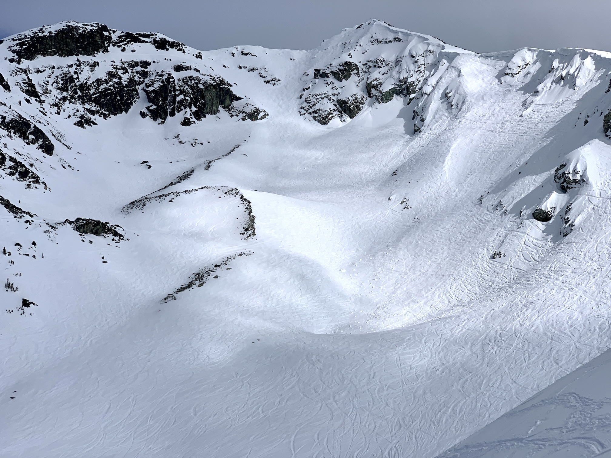

Trained as a physicist and engineer, I now enjoy tackling software engineering challenges. Lately, I've been learning as much as I can about machine learning, specifically focusing on [AI alignment](https://en.wikipedia.org/wiki/AI_alignment) and [mechanistic interpretability](https://arxiv.org/html/2404.14082v1).

My career has spanned research, entrepreneurship, running brick and mortar businesses, and leading teams and technical projects at both startups and small-but-mighty organizations embedded in large institutions.

Over the years, I've called Toronto, Ann Arbor, Paris, Vancouver, Amsterdam, and Oxford home. I love the outdoors and am privileged to now have the flexibility to spend most of my time in places with exceptionally stunning nature nearby.

#

### Photograph © Monica Spisar 2024 [CC BY-SA 4.0](https://creativecommons.org/licenses/by-sa/4.0)