## James Mickens on the value of skepticism

_Notes from [James Mickens' talk at USENIX Security '18](https://www.youtube.com/watch?v=ajGX7odA87k)._

If you haven't seen James' talk and have an hour to view his actual keynote, please do yourself a favor and just go see his talk. It's entertaining, educational, and thought provoking. Absolutely not to be missed - the most fun you'll have while thinking about cybersecurity, machine learning, and computing more generally. Case in point, a fun still from his talk…

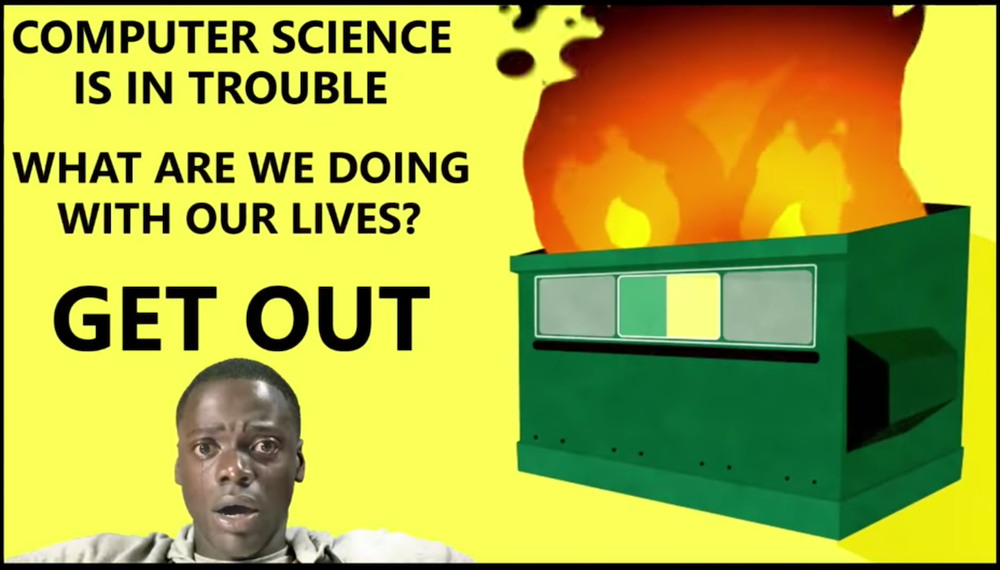

## Leave me in peace, Wizard

While James reads a book outside a cafe in SF, a magician tries to entice James to watch him perform a magic trick – only to be met with 'Leave me in peace, Wizard.' James insists he's not being anti-social, he's just resigned to the fact that magic is nothing more than visual trickery.

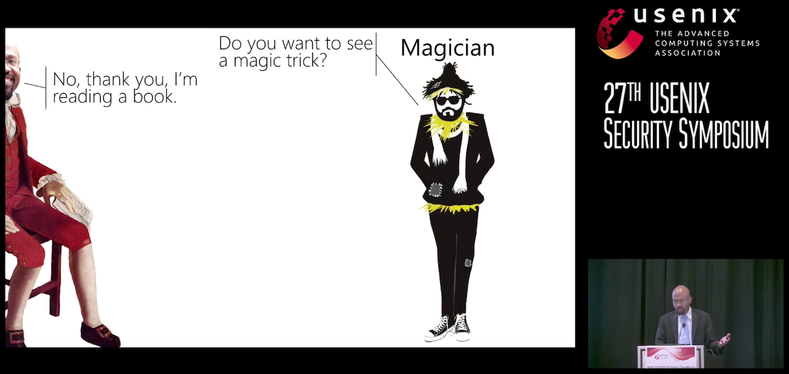

And, thus, James sets out to encourage us to join him in being rationally skeptical; to question, to never accept on face value - well, anything, presumably, but particularly that which seems too good to be true.

James dives straight into questioning the validity of machine learning's renown, likening it to an 'inverse fight club' where the first rule of ML fight club is that one must talk about fight club, and the "second rule: let's not fight because we all agree M.L. is awesome." Yay! Until one realizes that, with only the slightest of modifications, machine learning propaganda might easily be mistaken for the next Orwellian frontier.

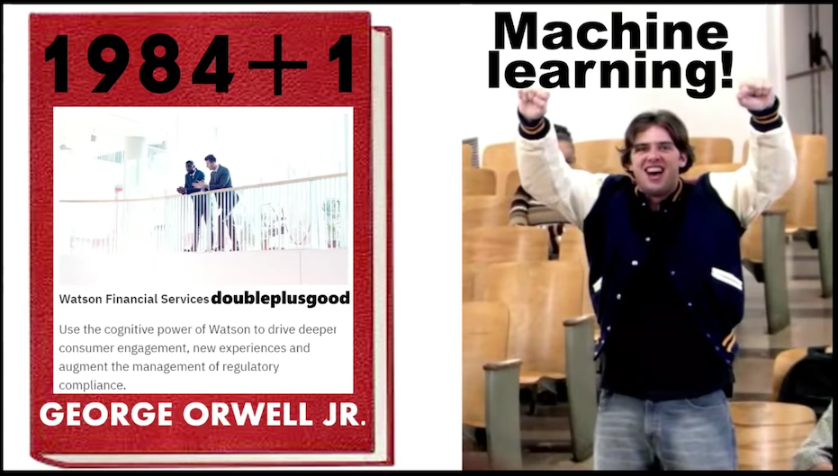

## "The increasing use of AI is actually problematic from a security perspective"

Connecting ML to the internet is an obvious hazard: "the internet is just this cauldron of evil" and machine learning scientists admit they "don't know how machine learning works." (ed: James is never one to mince words, which is largely why his talks are so entertaining and informative, but I digress… Here, he's referring to the black box nature of deep learning, in particular.)

## Machine learning specifics: let's consider gradient descent

Actually, let's first consider James' excellent representation of MNIST - if only because I can't resist sharing the relevant still from his talk.

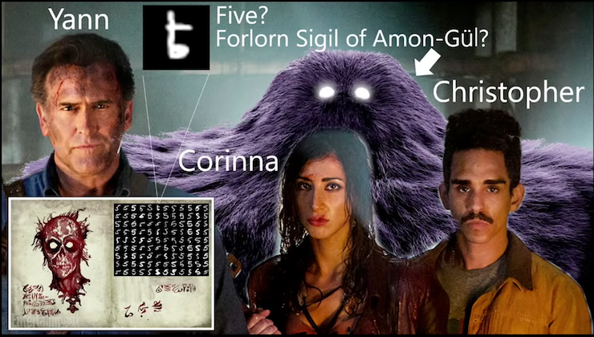

Text classifiers often use MNIST as their training dataset, as represented by James in this slide which includes depictions of MNIST's creators along with a representative classification problem:

_Is the symbol a 5 or the Forlorn Sigil of Amon-Gül?_

James presents this question in jest, but it accurately represents the issue of bias in training data: your machine learning model will give you the answer you've already told the machine you want to hear. The machine will not speak truth to (training data) power. At least, not in its current forms. (There is much to unpack in relation to how bias is built right in to machine learning – a whole other topic.)

Back to gradient descent. The essential process is to identify parameter values which minimize the model's errors in making a prediction. The parameters thus obtained, as well as the degree to which model predictions are, in fact, accurate, depend strongly on nuances of the gradient descent algorithm.

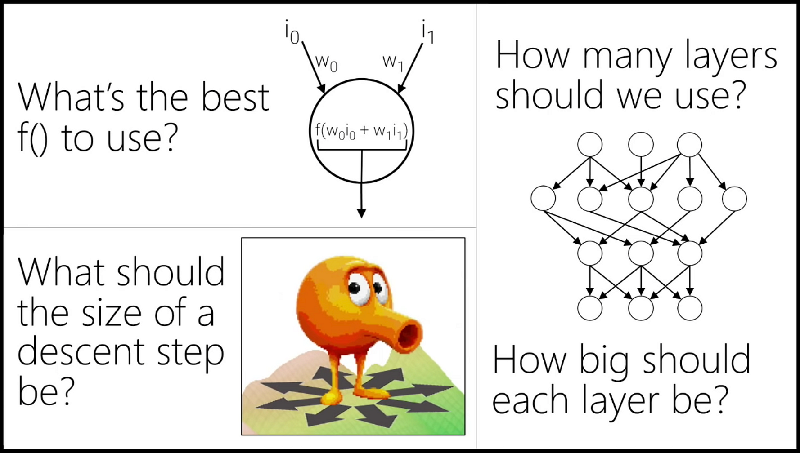

Importantly, there is no fundamental law to guide the optimization of the gradient descent algorithm - the parameters are tuned via trial and error. In James' words, machine learning is the computer science equivalent of the egg drop experiment: "do some stuff" and, if it works, go with it.

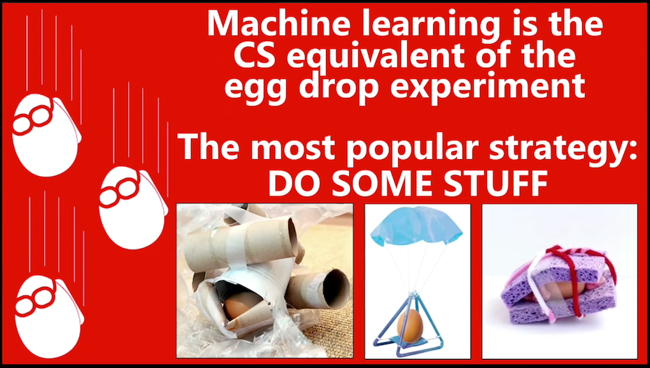

## Connecting a giant mystery to… mission-critical systems?

Ultimately, even if we accept that the inscrutability of AI is fine (for now), there are still two very serious mistakes we're making: applying it to "important real-life things" and connecting it to "the internet of hate."

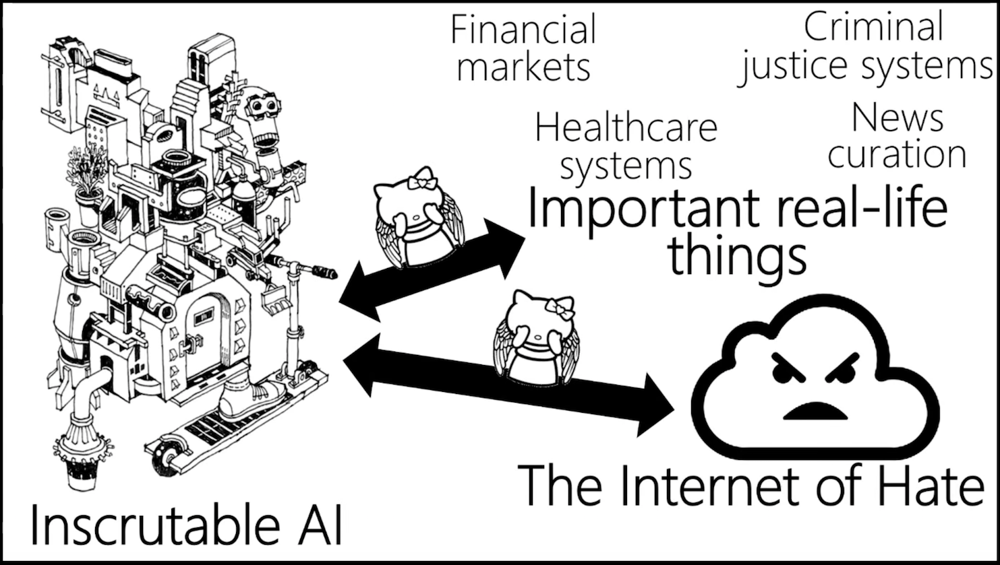

As James puts it, we're connecting a giant mystery to mission-critical systems.

_Why would anyone do this?_

"AI mission creep is extremely problematic. We don't understand how these algorithms learn, how bias might have crept into the training data, or how machine learning algorithms might behave when subjected to targeted attacks." Case in point: Darth Tay.

This passage from James is too good not to straight up quote: "Tay would emerge, glorious and wise, to usher us into a golden age of conversation understanding and we would look at our creation and we would be proud because our glorious AI child had learned dignity and decency from crowd-sourced tweets - wait?! what was that?" Alas, the creators of Tay forgot what the internet actually is, so James provides a handy reminder.

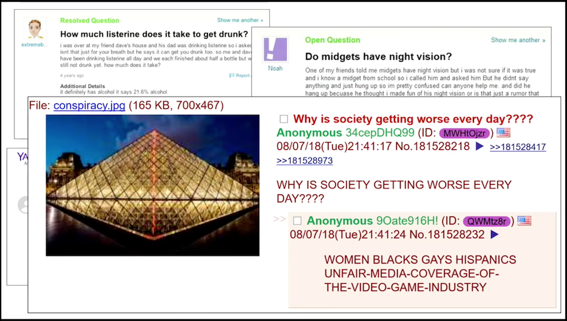

## Defining computer security

Moving on… James notes that the definition of computer security needs revisiting and serious contemplation to evolve alongside distributed, internet-connected computer systems.

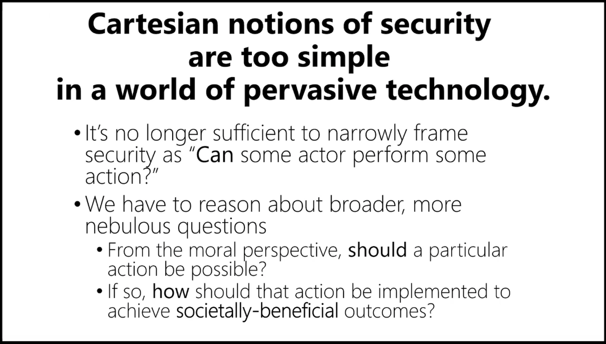

There's no escaping the fact that, as James puts it, "the tech industry has become detached from the ramifications of the systems it has built." Cases in point: Tay, risk assessment in the criminal justice system, gender recognition in faces, among others. The reality is that bias is embedded in both data and algorithms.

## Technology is the one true path… to what?

We don't need any more flashlight apps aka it's time to question technologists' manifest destiny…

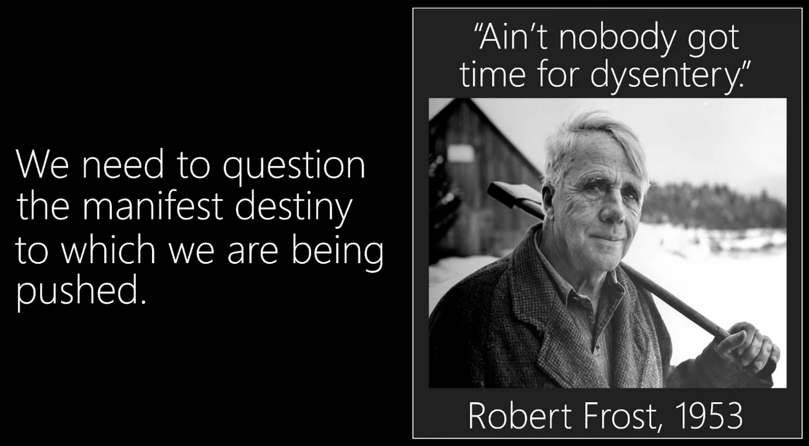

"Anyone who's played Oregon Trail knows that manifest destiny leads to dysentery." (And, no, the quote in the image doesn't come from Robert Frost - but, in James' estimation, the technologists are at greater risk of not knowing that than the liberal arts folks, and… he considers this a disadvantage the tech community propagates at its own risk – and at the risk of those whose lives are touched by technology. In other words, everyone.)

## Manifest destiny

So, what are the core tenets of technological manifest destiny?

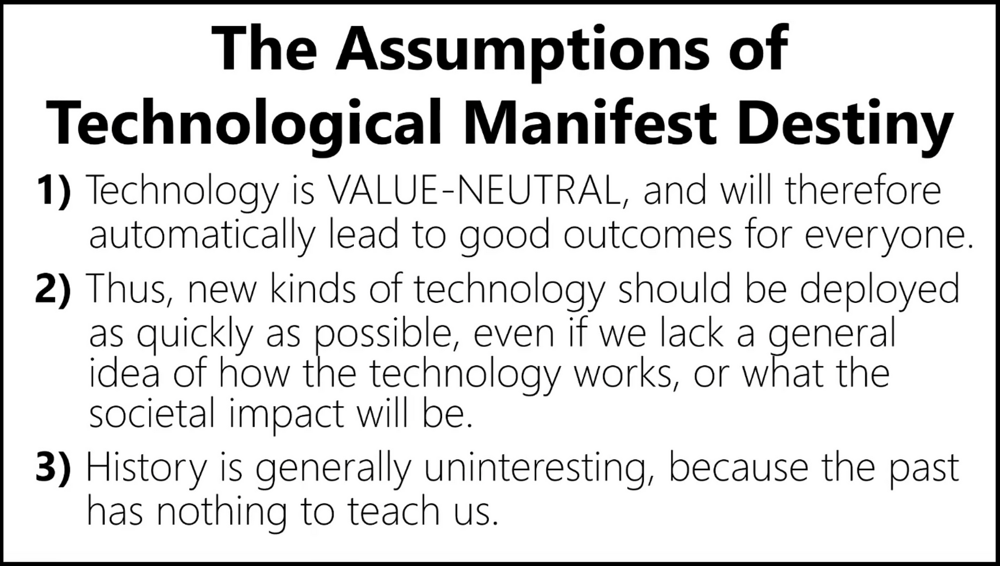

Consider these tenets in the context of criminal justice decision making. "Humans are biased but data is not - or so we've been told." Of course, humans generate all social data, so this is, in fact, false. Extending the realization that these core tenets of technological manifest destiny are clearly open to question, James moves on from the context of artificial intelligence to security considerations for IoT.

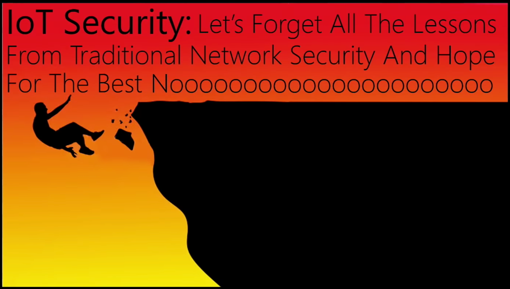

Astonishingly, even today, some medical devices send data in cleartext format - IoT has leapt ahead without addressing security appropriately. Devices are sending unencrypted personal data when, at the very least, they should be using TLS.

_(Yes, we should all know what TLS is: Transport Layer Security (TLS), and its now-deprecated predecessor, Secure Sockets Layer (SSL), are cryptographic protocols designed to provide communications security over a computer network.)_

IoT folks claim that addressing security considerations wouldn't work with the business model, and James argues that price cannot be the only consideration, or you end up with… potato hands.

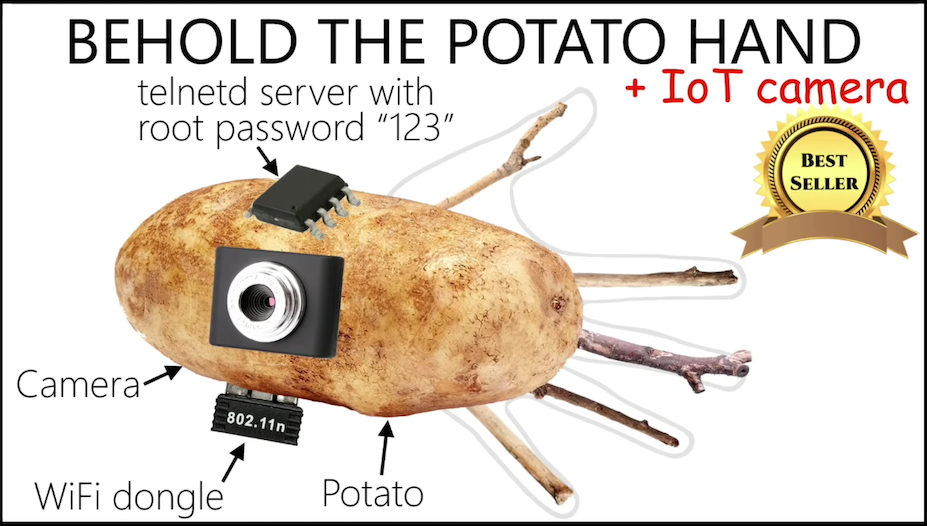 

Wrapping up his lively talk, James summarizes his perspective on taking a skeptical approach to computer security:

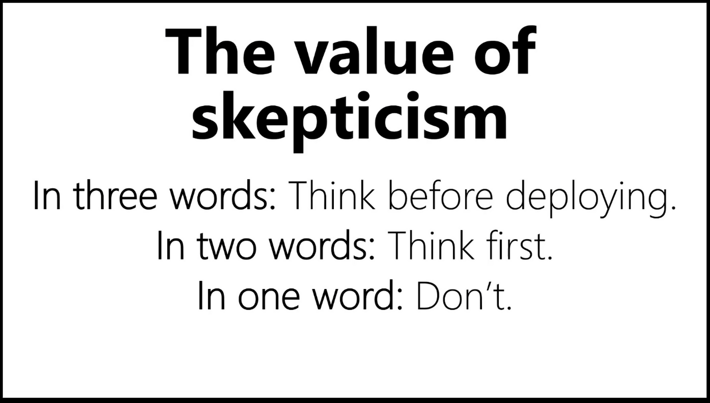

_Originally published on [Medium](https://medium.com/@msyvr/leave-me-in-peace-wizard-4f4216595cff) in 2018_
