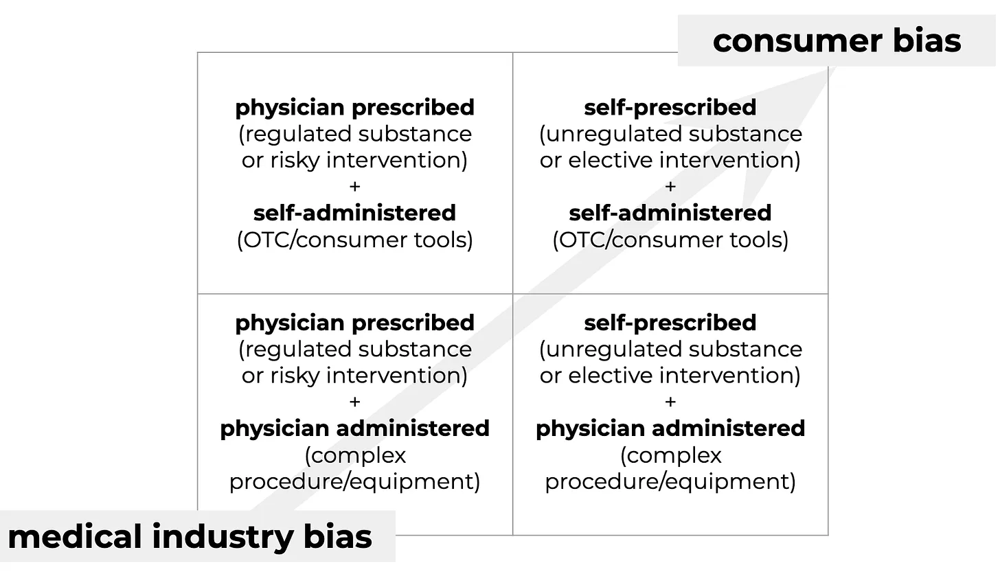

## Scaling biohacking

### The landscape for delivering longevity interventions at scale

Longevity intervention can be a loaded expression, too often carrying the weight of association with quests for immortality. According to Merriam-Webster, longevity is ‘a long duration of individual life.’ Leaping from long duration to forever is a stretch, but there’s good reason to interrogate the standard assumptions around the boundaries of ‘long.’

In that direction, the geroscience hypothesis proposes that specific biological processes can be modulated to delay or prevent the decline of normal systemic biological function over time. Sustained (and potentially improved) biological health status then serves to deter the onset of age-associated morbidities, ultimately supporting extended lifespan. As yet undiscovered (or as yet unconfirmed) ways to influence our biological longevity are very real possibilities. 

Keeping your [blood sugar levels under the prediabetic zone](https://dom-pubs.onlinelibrary.wiley.com/doi/epdf/10.1111/dom.14321) is a longevity hack. So can be [senolytics](https://www.afar.org/ask-the-expert/james-kirkland-md-phd-on-expanded-senolytics-geroscience-and-translation-part-2). Commercial efforts to develop focused interventions - which modulate specific biological targets in aging-associated pathways - are ramping up. Broadly, though, longevity interventions (LIs) take many shapes, from lifestyle optimizations to supplements to drugs to gene & regenerative therapies.

Some LIs are destined to be widely available and practically free; some will remain harder to access or reserved for the very wealthy. Some take sustained effort while others involve popping a pill. It’s a mixed bag of options with widely varying degrees of (current and anticipated) validation.

## Finding the needle in the haystack

The legitimacy problem is the first major roadblock to both delivery and adoption: standardized metrics and methods for evaluating impact (efficacy) aren’t yet available. Looking ahead, once clarity and consensus have been reached on evaluating efficacy - how will individuals access these interventions? Not all LIs will be regulated or involve complex procedures - will LIs primarily be medically prescribed? And how to enable adoption? In their truest form, LIs maintain biostatus[^1], so the disease-centric approach that’s such a great fit for the FDA and institutionalized health care seems a mismatch. Will most doctors be comfortable prescribing LIs to seemingly healthy individuals in, say, their 30s? Or even sooner - before age associated biological decline begins?

Whether delivered via a healthcare intermediary or self-administered, it will be necessary to determine what’s effective for an individual, then monitor biostatus to enable fine tuning and adaptations over the longer term. What’s the suite of measurements needed for a comprehensive readout? And how often to measure so the feedback loop supports effective iterative refinement? These are all open questions at the moment.

A single LI that’s likely to optimally mitigate all processes involved in deleterious aging for everyone hasn’t been identified, and there’s no theoretical or practical basis on which to expect that will be the case. Combining interventions is a tricky business, though. Beyond the complexity of figuring out which stand-alone LIs have the greatest impact on individual biostatus, multiple interventions’ effects may not simply be additive - or combinationally safe.

## Innovating fast and slow

These are very early days for targeted LIs that go beyond healthy diet and regular exercise, and progress is both fast and slow. Geroscience research is rapidly generating [actionable data](https://www.sciencedirect.com/science/article/pii/S2468501117300081), existing datasets are [pointing the way to promising candidates and biomarkers](https://www.sciencedirect.com/science/article/pii/S156816371830240X), and both academic and startup ecosystems in this space are [thriving](https://academic.oup.com/ppar/article/29/4/134/5585520). Those are the (relatively) fast parts. And the slow?

Testing candidate LIs takes time, and it’s still an emerging science. But there are candidates pretty far along that journey. The slow pace of that last mile owes more to two other factors: a crisis of confidence, and many LI candidates’ (current) go-to-market strategy. Let’s take a slightly closer look at each.

### Crisis of confidence

Longevity is still somewhat polluted with snake oil merchants, and it suffers from various misperceptions. At Basel Life’s 2019 [Aging, Drug Discovery & Artificial Intelligence innovation forum](https://www.basellife.org/2019/basel-life-structure/innovation-forums/scientific-programme/aging-drug-discovery-artificial-intelligence.html), I listened to a panel of prominent geroscience folks agree that the messaging around interventions for biological aging is one of the key deterrents to progress. Interventions that have a credible degree of scientific validation haven’t been hugely successful in distinguishing themselves from those with none. Doubts about scientific legitimacy and real-world efficacy weigh heavily on the field, negatively impacting funding, access to talent, and adoption.

### Getting to market

In terms of go-to-market strategy: candidates (regulated or not) with no IP moat tend to (mostly) be abandoned - ignored by investors, regardless of interventional potential. In terms of where the money flows, the majority of individual LI candidates currently in R&D aim to be FDA-regulated. Adopting the traditional pharma playbook, the regulatory approvals process contorts the promise of ideally preventive interventions to force a fit with the disease-treatment paradigm that dominates modern medicine - from physicians to insurers to big pharma to funders (including government and key philanthropic foundations).

Navigating the approvals process has some inherent complexities when it comes to LIs - the most obvious being assessing clinical impact. After demonstrating safety, demonstrating clinical impact is the key to gaining FDA approval (unless you’re Aducanumab?). Circling back to the concept of longevity interventions as preventing biological decline prompts the question: how is clinical impact effectively demonstrated when the goal is preventive, and when the ultimate endpoint would presumably be death? 

## Metrics are hard...

... and the wrong metrics can derail everything.

Every line of inquiry into potential interventions eventually bumps into the fact that validated, standardized metrics for assessing deleterious biological aging (aka biomarkers of aging) are [still in the works](https://www.youtube.com/watch?v=zNlP4d11RGc). There is no holistic measure of ‘biological aging’ per se and, thus, no direct metric for efficacy of LIs. (The [TAME trial](https://www.afar.org/tame-trial) is [one attempt](https://www.ncbi.nlm.nih.gov/pmc/articles/PMC6428447/) at moving the needle on this.) The workaround leverages the status quo: identify a disease with a known mechanistic link to the candidate LI and then [design the trial around that disease](https://pubmed.ncbi.nlm.nih.gov/30616998/).

But.

Compensating for gradual, mild decline from peak/optimal biology isn’t quite equivalent to rescuing decline from an already degraded state (advanced age or age-associated disease): not only is the bar set higher, but the goal posts may very well have shifted. So, this strategy may not actually deliver on the promise of preventive LIs, and may even miss or [sideline](https://clinicaltrials.gov/ct2/show/NCT04139915) good candidates.

A direct strategy for finding and validating effective LIs would focus solely on prevention, aiming for biostatus optimization. This would also avoid overlooking LIs which have a positive effect on aging but not on treating disease. Setting aside the (very important) question of how to evaluate efficacy for the moment, what does the solution space look like from a delivery perspective?

## Patient, heal thyself

Categorized according to user agency in LI selection and administration:

Current development efforts favor the quadrants with physician involvement (regulated and/or procedurally complex), motivated by the traditional biotech playbook that hinges on IP moats, the disease treatment paradigm, and delivery via established healthcare systems. 

Not only does this strategy risk potentially sidelining effective LIs, it’ll almost certainly limit the market to the elderly and/or sick.

The most immediate promise for everyone to benefit from longevity interventions - both those available now and those on the horizon - may rest with the upper right quadrant: self-prescribed + self-administered. No delays associated with gaming the approvals process by introducing a disease angle, and a real possibility of tapping a larger market: peak biological health is attained roughly in our early 20s, so maintaining that biostatus means ideally starting LIs in early adulthood or midlife.

### A flourishing DIY ecosystem

Because of its rules of engagement and incentive structure, the Big Med/Pharma isn’t really set up to dive into this scenario. But geroscience has vetted the first generation of interventional possibilities - biohackers are already on it, and the tools are only getting better.

Data reflecting the biological impacts of diet, exercise, and other lifestyle interventions are readily available, as are wearables and other consumer-grade devices for monitoring specific biological attributes and patterns. Data science and machine learning correlate the data with changes in health status. New sensors are being developed to yield orthogonal and complementary data, improving sensitivity, specificity, and predictive ability.

Opportunities for progress extend well beyond new sensors. Integrating personal health data across devices for coordinated analysis is, at best, a partially-solved problem. Leaning on machine learning algorithms and models trained on collective data comes with a host of concerns. Data literacy can’t be assumed beyond the quantified self crowd; at scale, users will expect support and guidance to make the most of their data.

As a bonus, a consumer-centric approach is synergistic with supporting regulated or less directly accessible longevity initiatives: Biohacking raises the bar on consumers’ relationships with their own health and lifespan. Scaling biohacking empowers a collective demand for more - and faster.

[^1]: I’ve adopted ‘biostatus’ optimistically: there’s no equivalent in the current medical ecosystem. But there should be.

#### Originally published on [Substack](https://gamingaging.substack.com/p/longevity-home) in 2021