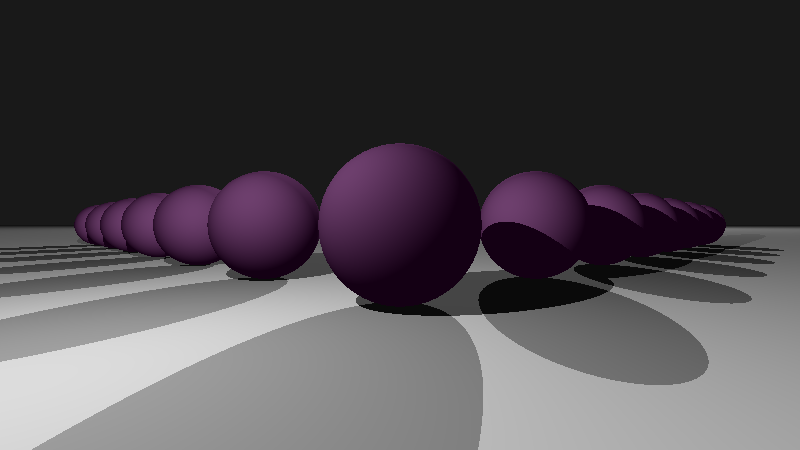

During my first [Recurse Center](https://recurse.com") retreat in the fall of 2021, I worked on code craftsmanship and experimented with a variety of software engineering concepts. One tangent led me to writing a [ray tracing engine](https://github.com/msyvr/raytracer).

## GPUs rule

In the course of exploring photorealistic image generation for movies and games, I discovered that the practical execution of [algorithms which simulate realistic (physics-based) illumination](https://pbr-book.org/3ed-2018/Introduction/Photorealistic_Rendering_and_the_Ray-Tracing_Algorithm) is made possible by phenomenal advances in [dedicated hardware, supported by machine learning](https://developer.nvidia.com/nvidia-ampere).

## No GPU, no problem... (?)

I wrote my [ray tracer](https://github.com/msyvr/raytracer/blob/main/main.py) in python as I was learning that language at the time. It simulates in-scene light interactions, including diffuse surface scattering (Lambertian) and reflection/refraction (Fresnel, computed recursively). 

 

The code isn't performance optimized, nor architected to leverage GPU capabilities. I nonetheless got a rapid fire intro to real world implementations of ray and path tracing - there's some extremely cool research in that space!

## ... really, though - you need GPUs

Realistic images at high frame rates for games rely on [innovative approaches stitched together to meet stringent technical constraints](https://www.youtube.com/watch?v=2GYXuM10riw), and exquisite animations and special effects in movies are made possible by a combination of [advanced hardware and software supported by dedicated computer clusters (aka render farms)](https://sciencebehindpixar.org/pipeline/rendering). And both applications depend on sophisticated [GPU platforms optimized for ray tracing](https://developer.nvidia.com/rtx/raytracing). In the hands of skilled artists, this incredible technology generates delightfully photorealistic images and animations.

---
#### This post was originally published in 2021 on an earlier version of [this website](https://monicaspisar.com).