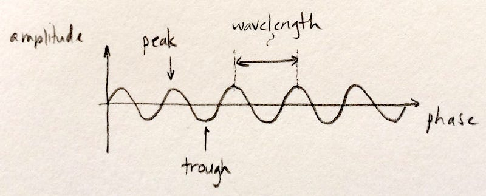
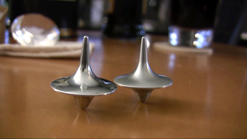

## Seeing within: Magical imaging

Much of the complexity of the human body is shrouded in mystery. But we know a lot more than we used to about its structure and function. Structure (anatomy), in particular, has been mapped out in meticulous detail. In the distant past, building up static anatomical maps relied on information from dissections. Yeah, gross. Also, pretty much useless to a live person needing guidance for treatment of injury or disease, or for monitoring a chronic condition. Of course, we now have alternatives to dissection. Whew. So, how does that seeing within work?
#

Humans perceive the world via our senses, one of which is sight. Our eyes respond to light, and the kind of light humans can see just doesn't make it far past the surface of the body. It's strongly attenuated via absorption and scattering in skin, fat, muscle, bone, and connective tissues. Basically, the kind of light humans can see - visible light - dies trying to get in; our eyes perceive only the very top surface. Sorry about that. (Or maybe not!) But…

Clever people have come up with creative ways to "look" into the body. Yay, medical imaging! You know - x-ray, nuclear, ultrasound, CT, MR. Hmmm. So, how do those all look deep inside when our eyes can't?

To answer that, let's talk a bit about how humans see. Our eyes are set up to respond to light (specifically, visible light). The receptors in our eyes fire off a signal (blip!) when visible light reaches them. Those signal blips make their way to a dedicated part of the brain and… I'm leaping ahead here. There's more to the story - let's backtrack a little.

## Reflecting on the world

It's not often that we look directly at a source of light. Candles, sure, but sources of light like the sun or a lightbulb tend to be too intense to look at without feeling uncomfortable (or being blinded). And, anyhow, we want to look around and see everything, not just sources of light. So, what we mostly look at (except when looking at our device screens; okay, it's a big 'except'…) are secondary sources of light - objects that redirect light from primary sources.

We see the world by watching how it redirects light to our eyes. That redirected light carries information about the interactions it had on its way to our eyes. Our brains collect that information, process it, and create pictures representing the physical world, as conveyed by the light. Yup. I totally glossed over that last part - busted! Let's just call it image processing when our brains take in all the blips of redirected light hitting our retinas and transform those into live streaming images of our world. Pretty cool.

## Surf's up

Okay, back to looking inside bodies. To avoid putting needles or other material probes into the body (ouch), some crafty people figured out you can use waves instead and avoid disturbing things too much. So, let's talk a bit about waves. The physics-y kind.

Picture some gentle water waves in the ocean. So soothing. Or, picture some monster waves you're dying to shred. Take your pick. Either way, like water waves, the physics-y waves in medical imaging have an amplitude (height of the peak of the wave) and phase (the part of the wave you're at: the peak, the trough, or somewhere in between). Importantly, they also have a length: the distance from one peak to the next. (It wouldn't be a wave if it didn't repeat that way and have a more-or-less constant peak-to-peak distance.) Since we're talking about a wave, that length is called a wavelength.
#

Now - the key point about waves is that they can store and transport information in their amplitude, phase, and wavelength. A wave travelling uninterrupted from source to detector will have a different signature than one which has interactions along the way. Different types of interactions will have different effects on the amplitude, phase, or wavelength - and those effects can be unrolled to create a map (image) of those interactions.

## In and out, nobody gets hurt

Remember how we built up a picture of our world from secondary light sources that redirected the light from the sun or a lightbulb to our eyes? Most of what we normally think of as medical imaging works on a similar premise-but with waves that can make it into the body, travel through it & interact with it without being completely attenuated or scattered, and ultimately get redirected to the imaging system's eyes. Our system's brain will then create an image of the things the waves interacted with on their journey.

So, we need waves that don't die at the entry point like visible light does. We also need to avoid waves that pass right through undisturbed. Interactions between the waves and the target we'd like to see have to be detectable somehow, and that's impossible if they don't have any effect on our waves. What we need are waves that can go some distance in the body, interact, then make it out without being scattered and attenuated too much. It turns out that the major building blocks of the body (skin, bone, muscle, fat) aren't entirely transparent nor entirely opaque to a bunch of different kinds of waves, and these are the waves that are useful for seeing into the body.

Electromagnetic and pressure (aka acoustic) waves tuned to the right wavelengths and shaped into pulses end up fitting the bill. (Note: electromagnetic includes visible light, but also other wavelengths that work for medical imaging.) Yes, those waves are still attenuated to a degree: the amplitudes of the waves decrease as the waves travel through the body. But, remember, that's a good thing, in moderation. Medical imaging waves are tailored to strike a balance between blasting right through the body and interacting with the body just enough to get encoded and redirected out without dying off on the way.

## Mirror, mirror

Now, think about this: if you look into a mirror and your image isn't distorted, you know that the mirror is flat and smooth. That may not be an entirely obvious thing since you arrive at that knowledge through inference. You're not looking at the surface itself, but you infer something about the surface because of the way your reflection looks. If you see a warped image, you know that the mirror is bumpy/curved/not flat. Think hall of mirrors.
#

What you see tells you something about the surface that redirected the light to your eyes. (Note that a single point reflected won't tell you much about either a flat or a warped mirror. You need an image.)

Medical imaging works the same way (except for MRI - more on that later). The information in the image is inferred. The waves of choice interact with the object you want to look at, get encoded with information about the object, then get redirected to the system's eyes. The eyes pass the information to the system's brain which then generates a picture of the object - a picture which isn't perfect, nor perfectly accurate. It's an interpretation of the information the waves carried out of the body to create a representation of the physical world, like a picture taken by a camera.

## Riding a wave

Of course, the clever folks that create medical imaging systems have to figure out a few things to make it all work. And one important piece is how to select and tailor the waves so they 1) interact with the targets we want to look at just the right amount to get encoded with information, 2) get redirected to our system's eyes by those targets, and 3) ultimately deliver the coded information to the system.

Without going into further detail on all that, the waves a particular system is able to see determines the flavor of that system. The most common medical imaging flavors (aka modalities) and the waves they use are: x-ray (x-rays (surprise!)), nuclear (gamma rays), ultrasound (acoustic waves), CT (x-rays with multiple 2D views cleverly merged to get a 3D volumetric image).

A note about these flavors. Because their waves are attenuated and scattered differently, they each carry different information out of the body. For example, x-rays pass straight through soft tissue, like skin and fat, but interact with bone. (Bone is dense enough to absorb/deflect x-rays' higher energies to some degree.) So, x-rays are used to look at bone, not skin. On the other hand, ultrasound is practically killed off when it hits bone, but it interacts more moderately with softer tissues like muscle or tendons. So, ultrasound is used to look at hearts. And babies. Awww.

You probably noticed that MRI was conspicuously missing from the list. That was intentional because it works a little differently. Let's give that a wee bit of extra attention because it's an important imaging flavor.

## Spin up, spin down

Let's think about tops for a minute. You get a simple top spinning by applying an angular force. How the top spins depends on the particular top: its material, its mass, its shape. If the top were behind a glass partition and you couldn't pick it up to inspect it yourself, you could probably make some decent guesses about the top's characteristics by the way it spins.

Stay with me here. MR sets up lots and lots of spinning tops (water molecules, actually) inside the body, and watches how they spin. Wait - what? Well, individual water molecules sometimes respond to magnetic energy by spinning. The medical imaging system has to apply the magnetic energy just the right way, but then you have spinning water molecule tops in the body. So, how (and why) do we watch them?

The body's full of water, but we're not just bags of fluid, so the way water's distributed tells us about the structures that contain that water. By mapping out the locations of the spinning tops, we'll know where they are and where they aren't. Well, it happens that magnetized water molecules can interact with, encode, and redirect waves. The waves have to be just right, of course. And MRI systems are set up to send those in after the initial magnetization that gets the tops spinning. The encoded & redirected waves make it to the eyes of the system and deliver the information about the tops (water molecules).

So we can see where the tops are, and also collect other information that the spinning tops encoded into the wave. It's all very quantum and magical, but there it is, and at least some of those waves make it out of the body to our system's eyes (that was lucky!).

Now we know where the water is, and the outlines around the pools of water are structures. Cells, muscles, ligaments - they're all containers for water, and MR imaging can see them. (There are tons more tricks with MR - a major one involving oxygen's influence on the whole spinning tops shenanigan and using that to see more than just structures … to actually see function, e.g., in the brain which consumes more oxygen when you think. Quite a ways beyond the scope of this intro, but I highly recommend you look up functional MRI if you're interested. It's all very cool.)

## Eye of the beholder

Naturally, the imaging system designers also have to figure out which 'eyes' will work for the waves we're watching for. Remember that human eyes respond to visible light? But x-rays blast right through our retinas, as do gamma rays. And our eyes certainly can't hear ultrasound, and nor can human ears. A sensor - called the detector - that responds to the waves carrying the encoded information will be the eyes of the system. Of course, the medical imaging folks always use waves that they a priori know will work with the system's detector eyes. It's a chicken and egg thing.

Anyhow, we now have waves bouncing around in the body, carrying information from the different structures, and ultimately reaching the imaging system eyes. Just like human eyes, the system eyes convert the waves to signals that a brain will magically turn into an image.

## Abracadabra

The brain that puts it all together to give us the actual image is, ultimately, a computer. The detector eyes send information to the computer brain, which processes it all. There's some pretty sophisticated code for converting raw data from the system eyes into images. Image processing uses a slew of complex mathemagical and computational tricks but, ultimately, it's all about translating the information that was encoded and delivered to the system eyes into an image. 

_Originally published on [Medium](https://medium.com/@msyvr/how-medical-imaging-works-59e116ecdbe5) in 2018_
