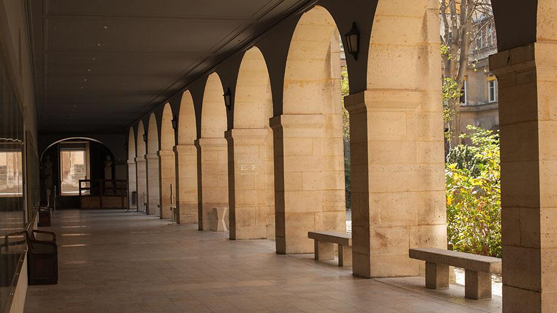

[>> Google scholar author page](https://scholar.google.com/citations?user=o6HuOMAAAAAJ&hl=en)

I started my career in academia and am an author on a dozen or so peer-reviewed publications and conference papers.

My degrees are in physics ([University of Toronto](https://www.utoronto.ca/), BSc) and engineering ([University of Michigan](https://www.engin.umich.edu/), PhD). My doctoral research was in the field of medical imaging; specifically, optical detection of ultrasound.

---

In [Matthew O'Donnell](https://scholar.google.com/citations?user=A9mPJnUAAAAJ&hl=en)'s group at Michigan, I led the detection subsystem efforts for an integrated high resolution laser ultrasound imaging system. I worked on both hardware and software, designing and building custom electronics, writing code for signal capture and image processing, fiddling with optical components and delicate materials, and pretty much living in the laser lab. A selection of related publications & conference papers:
  - [_Stabilized, resonant optoacoustic array detectors for medical imaging_](https://www.researchgate.net/profile/Monica-Spisar/publication/326274038_STABILIZED_RESONANT_OPTOACOUSTIC_ARRAY_DETECTORS_FOR_MEDICAL_IMAGING/links/5b43b3270f7e9bb59b1b032e/STABILIZED-RESONANT-OPTOACOUSTIC-ARRAY-DETECTORS-FOR-MEDICAL-IMAGING.pdf)
    
  - [_High frequency optoacoustic arrays using etalon detection_](https://doi.org/10.1109/58.818758)
  - [_High-frequency ultrasound array element using thermoelastic expansion in an elastomeric film_](https://doi.org/10.1063/1.1388027)
  - [_A high-frequency, 2-D array element using thermoelastic expansion in PDMS_](https://doi.org/10.1109/TUFFC.2003.1235327)

At the very start of my PhD, I worked on scintillation (gamma) cameras for early breast cancer detection. That work introduced me to statistical imaging methods, Monte Carlo simulations, and parallel computing. Related publications:

  - [_Simulation studies of light output in a full field-of-view small gamma camera_](https://doi.org/10.1109/NSSMIC.1997.670522)
  - [_Investigation of conjugate imaging using small gamma cameras_](https://doi.org/10.1109/NSSMIC.1997.670610)

I also spent a year as a postdoctoral researcher at [Université Pierre et Marie Curie (UPMC)](https://en.wikipedia.org/wiki/Pierre_and_Marie_Curie_University) aka Université Paris VI, now part of [Sorbonne Université](https://en.wikipedia.org/wiki/Sorbonne_University). There, I led a project on ultrasound imaging of tumor angiogenesis.

#

<!-- >[Campus des Cordeliers](https://www.sorbonne-universite.fr/universite/location-despaces/espaces-du-campus-des-cordeliers) -->